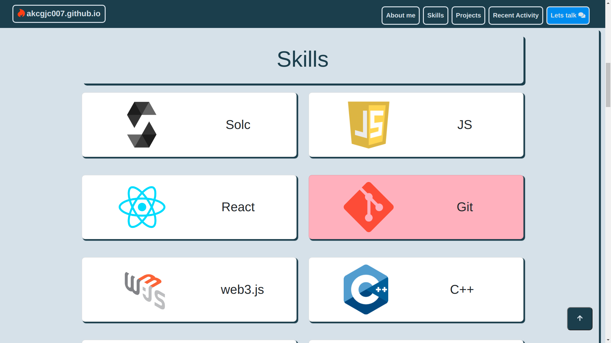
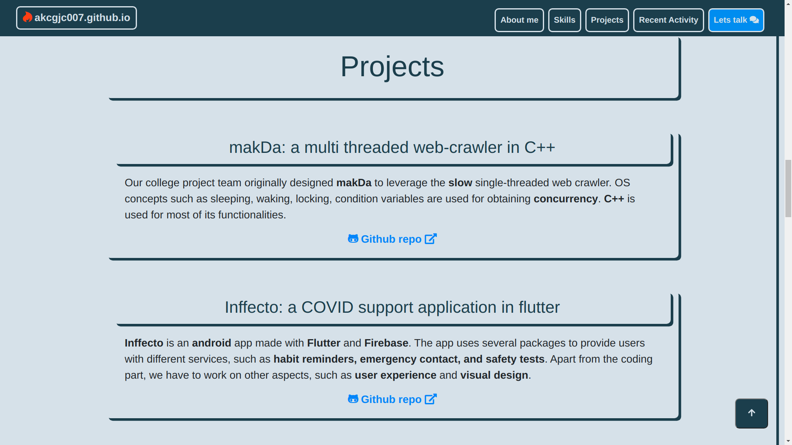
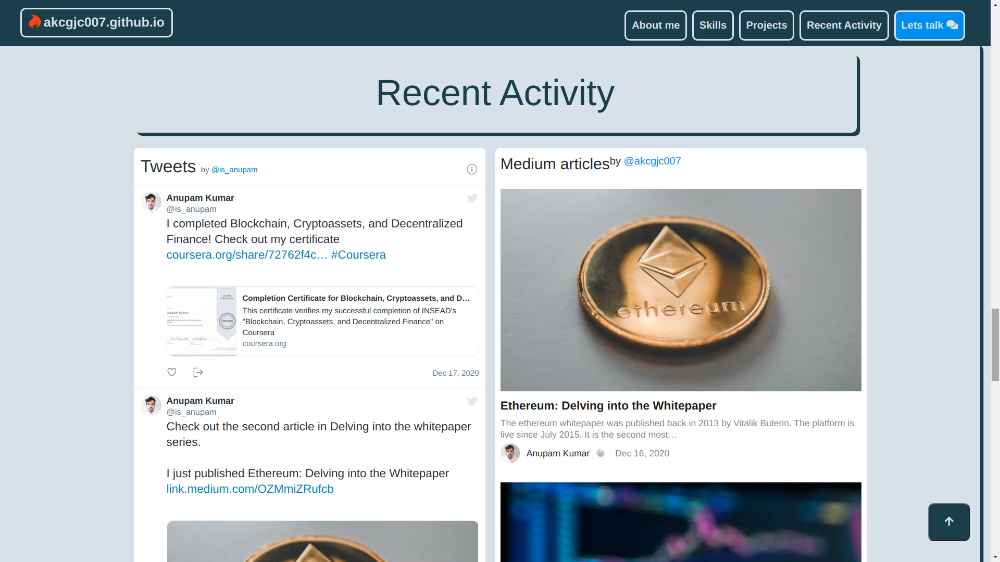
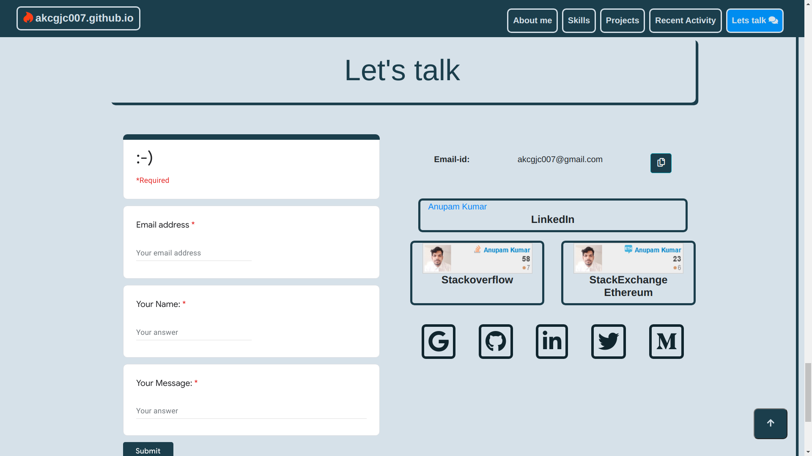

# <a href="akcgjc007.github.io" target="_blank">akcgjc007.github.io</a>
# 

## Introduction
I have created my portfolio website using **bootstrap**. CSS is used to more customization. One of the main features provided with bootstrap were the ability to make it compatible for devices of all screens.

## Components
 - Navbar
 - Jumbotron
 - About me
 - Skills
 - Projects
 - Recent activity
 - Let's talk
 - Social media links
 - Footer 

## Features
 - Responsive design

## Technology used
 - HTML
 - [Bootstrap](https://getbootstrap.com/)
 - CSS
 - Javascript
 - [Font Awesome icons](https://fontawesome.com/)

## Additional features
 - Twitter feed
 - Medium feed(Pixelpoint.io)
 - Google form
 - SO cards

## Sample pictures: Desktop

## Contributors
<table><tr><td align="center">
        <a href="https://github.com/akcgjc007">
            
             
            <b>Anupam Kumar</b>
        </a>
    </td></tr>
</table>
